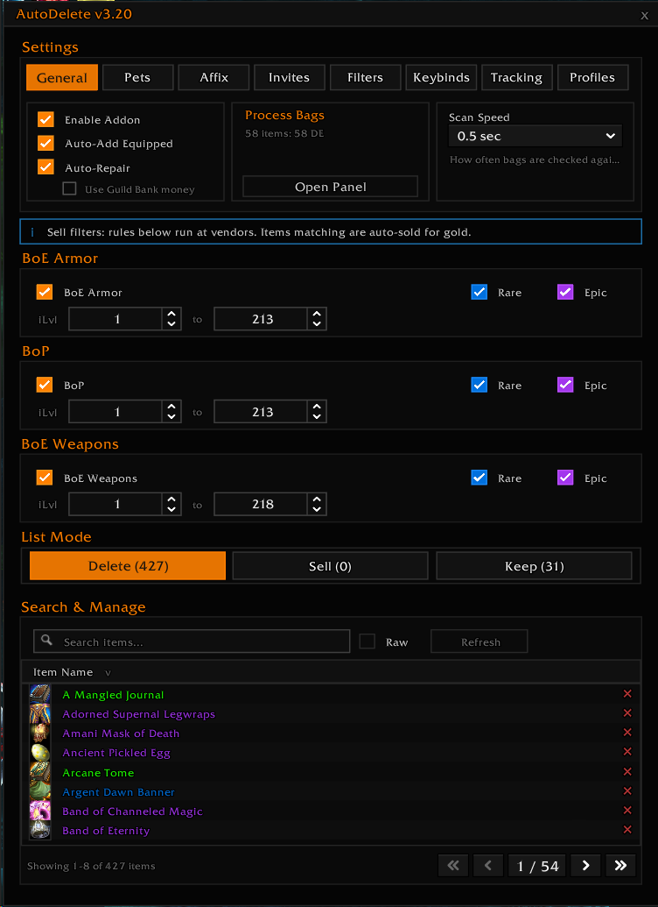

<div align="center">

# AutoDelete

WoW 3.3.5a inventory manager for Project Ebonhold. Mark items to **Delete**, **Sell**, or **Keep**. Every automatic feature is opt-in.

[](https://github.com/disarrayed/AutoDelete/releases/latest)
[](https://github.com/disarrayed/AutoDelete/releases)


[**Download**](https://github.com/disarrayed/AutoDelete/releases/latest) · [**Source**](https://github.com/disarrayed/AutoDelete)



</div>

---

## 🧠 How it works

Three lists per character:

| List | Behavior |
|------|----------|
| **Delete** | Destroyed on the next bag scan |
| **Sell** | Sold the next time you open a vendor |
| **Keep** | Protected from every auto-rule |

Drag items onto the Delete / Sell / Keep buttons next to your bags, or open the settings panel and edit each list directly.

Quest items are protected from every auto-rule, regardless of list state.

---

## ✨ Features

**Lists**
- Drag-and-drop or shift-click to add items
- Per-character lists with profile copy
- Built-in search and raw view
- **Import Raw** (Profile tab): paste item names, item links, `item:<id>`, or plain numeric IDs, then pick Delete, Sell, or Keep. AutoDelete resolves cached names, current bag items, and known list entries, while reporting ambiguous or unresolved names instead of guessing.
- **Import Lists** (Profile tab): copy lists from a known item-name catalog
- **Export Raw** (Profile tab): dumps any list as plain text for sharing or backup. Pre-selected on open so Ctrl+C grabs it.
- **Audit Lists** (Profile tab or `/del audit`): copyable report for duplicates, cross-list conflicts, name-only entries, same-name item ID traps, and uncached item IDs. **Fix Safe** removes same-list duplicates and normalizes safe item references only.
- **Manage Ignored Items** (Filters tab): view and clear the per-item skip list that builds up when you accept Keep-override popups

**ElvUI bag buttons**
- Three buttons next to your bag frame: Delete, Sell, Keep
- Drop to add. Right-click to jump to that list's tab.

**Sell rules**

Three independent categories, each with its own iLvl range and Rare/Epic toggles.
- BoE Armor (bind-on-equip gear)
- BoP (bind-on-pickup gear)
- BoE Weapons (bind-on-equip weapon-slot items, priority over BoE Armor)

**Auto Actions** (Filters tab)
- Per-quality Del / Sell pills for Junk, Common, and Greens
- Click a pill to light it red (delete) or blue (sell). Click again to turn it off.
- Greens defaults to off. Green gear stays in bags unless you opt in.
- Cosmetic slots (shirts, tabards) and quest items are always protected

**Affix Protection** (Affix tab)
- Skip Auto-Delete and Auto-Sell for items carrying Project Ebonhold's affix marker
- Optional minimum iLvl floor so low-iLvl affix junk can still be cleared
- "Refresh List" scans your Delete / Sell lists for items the filter would now save
- "Update Affix List" opens a scrollable window with Learned and Unlearned tabs, grouped by tier. Click an affix name to select it for Ctrl+C; Enter or Escape clears the copy box.
- **Only missing affixes**: only show the affix dot on items whose affixes you haven't learned yet. Helps you spot fresh affixes worth keeping.

**Companion management**
- Auto-summon Greedy Scavenger and Goblin Merchant
- **Only in Combat** gates every automatic Greedy Scavenger summon, including After sell and After vendor close
- Mount-aware dismiss and re-summon
- Stuck detection via loot-event tracking
- Three-state Goblin defer: won't summon until AutoDelete has had a chance to clear bags

**One-Key actions** (Keybinds tab)
- Bind a key to any of: Disenchant, Mill, Prospect, or Open a container
- Each press acts on the next eligible item in your bags
- Keep-list override warnings only appear when the matching one-key action is pressed
- Status line per row shows the next target, or "Requires <profession>" if the character can't perform the action
- Per-action Filters button to tune what each one targets

**Process Bags panel** (`/del process`)
- Standalone window showing what AutoDelete would do to each bag slot
- Filter rows by All, Sell, Delete, DE, Mill, Prospect, Open, or Kept
- Inspect what's about to happen before it does
- Items with the same item ID are grouped together to reduce repeated rows when affix names differ
- Left-click DE / Mill / Prospect / Open rows to arm that item for the matching keybind
- Left-click Sell / Delete / Kept rows to open Why?
- Right-click a row for quick actions: Keep, Sell, Delete, or Why? Ignore for Process appears only for one-key action rows.
- Alt+Right-click a real bag item for the same quick actions, without changing normal right-click item use

**Why? and report**
- Right-click a Process Bags row, then choose **Why?** for a copyable item decision report
- `/del report` opens a copyable diagnostic summary
- `/del history` opens a copyable recent decision log for this session
- The Help tab has topic buttons with practical how-to guidance for each main area

**Quality of life**
- Bags stay open when the vendor closes
- Auto-repair with optional guild bank fallback
- Hide Greedy Scavenger spam
- Auto-invite on whisper keyword, with loot rule and raid conversion options
- Per-character stats: gold earned, items sold or deleted, repairs, average inventory worth
- Welcome popup walks new users through setup. Reopen with `/del setup`.

---

## 📦 Install

1. Download the latest zip from [Releases](https://github.com/disarrayed/AutoDelete/releases)
2. Extract to `WoW\Interface\AddOns`
3. Folder must be named `AutoDelete` (rename if the extract created `AutoDelete-main`)
4. Restart WoW. A `/reload` is not enough on first install.

---

## ⌨️ Slash commands

```
/del               Open the settings panel
/del clean         Remove duplicates across Delete and Sell lists
/del sell          Force a sell pass at the current vendor
/del setup         Reopen the welcome popup
/del process       Open the Process Bags inspection window
/del report        Open a copyable diagnostic report
/del history       Open recent sell / delete / keep decisions
/del audit         Open a copyable Delete / Sell / Keep list audit
/del audit fix     Apply safe list cleanup only
/del affix         Open the Learned / Unlearned affix list
/del debug         Toggle the auto-sell / auto-delete debug trace
/del bench         Run a loot-burst performance benchmark (diagnostic)
/del spike         Capture frame-level performance spikes (diagnostic)
/del goblin        Open a copyable Goblin Merchant summon diagnostic
/del scav          Open a copyable Scavenger summon / retry / stuck-detection diagnostic
/autodelete        Alias for /del
```

---

## 🙏 Credits

Feature ideas and patterns from the community.

- **Affix Protection**, suggested by Biboup! [SBTL] on 5/13/26 at 4:23 PM:
  > Would it be possible to have an option to not delete items with affix or that's hard to do ?
- **Delete queue throttle pattern**, adapted from [Qloot](https://github.com/mmobrain/Qloot) by **Skulltrail**. AutoDelete v3.20 uses the same OnUpdate-drained queue approach to spread bag-delete API costs across frames instead of bursting them.
- **Performance feedback and Qloot pointer.** **Xurkon** flagged the delete-burst stutter on PE Discord and pointed at Qloot's throttle implementation.
- **Auto-Sell options for Junk and Common** (Filters tab), suggested by Sanavesa on 5/21/26 at 8:48 AM:
  > thanks for this addon. is it possible to add auto-sell junk/common? currently i see there is auto-delete options

---

## 📜 Influence

AutoDelete started February 5, 2026. EbonholdStuff by Badutski2 (GitHub repo created February 13, 2026, last commit February 17) is another addon in the same niche. Both use the same Blizzard 3.3.5a API surface; some ideas crossed over. The code is original, written from scratch, with no shared snippets.

AutoDelete has been re-implemented in part by EbonClearance, which is itself a fork of EbonholdStuff. We appreciate the shoutouts in their source comments, even when one cites "AutoDelete v3.14," a version we apparently forgot to ship. We'll get to it.

The chocolate box stays. We appreciate the passion. The chocolate would like you to know it is in a safe place.

Got good ideas? Use 'em anytime. Thanks for the shoutouts!

---

### A note on Auto-Open Containers

Auto-open was tested in development and removed before public release.

Why it was removed:
- WoW 3.3.5a blocks many container uses when an addon tries to fire them automatically.
- The client raises `ADDON_ACTION_BLOCKED` unless the action comes from a real click or key press.

What to do now:
- Right-click those containers manually.
- Use keybind-driven tools where available.

We may revisit this later as a keybind-first feature.

---

<div align="center">
<sub>Made with ❤️ and 🤖 for the Project Ebonhold community. Fork it. Rebrand it. I don't care.</sub>
</div>
